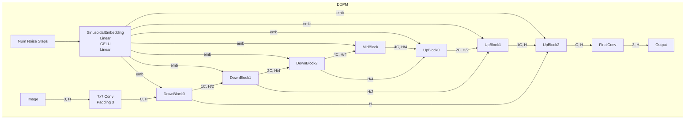
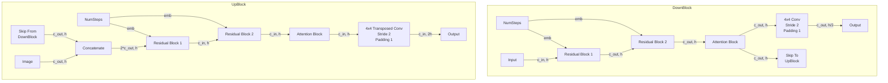
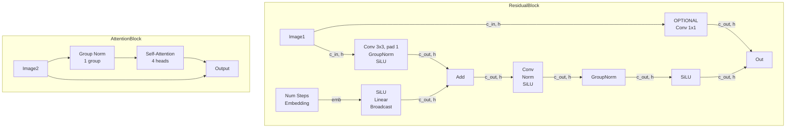

```mermaid
graph TD
    subgraph DDPM
        MTime[Num Noise Steps] --> MTimeLayer[SinusoidalEmbedding<br/>Linear</br>GELU<br/>Linear]
        MTimeLayer -->|emb|DownBlock0 & DownBlock1 & DownBlock2 & MidBlock & UpBlock0 & UpBlock1 & UpBlock2
        Image -->|3, H| InConv[7x7 Conv<br/>Padding 3] -->|C, H| DownBlock0 -->|1C, H/2| DownBlock1 -->|2C, H/4| DownBlock2 -->|4C, H/4| MidBlock -->|4C, H/4| UpBlock0 -->|2C, H/2| UpBlock1 -->|1C, H| UpBlock2 -->|C, H| FinalConv -->|3, H| Output
        DownBlock2 -->|H/4| UpBlock0
        DownBlock1 -->|H/2| UpBlock1
        DownBlock0 -->|H| UpBlock2
    end
```

```mermaid
graph TD
    subgraph DownBlock
        NumSteps -->|emb| DResnetBlock1 & DResnetBlock2
        DImage[Input] -->|c_in, h| DResnetBlock1[Residual Block 1] -->|c_out, h| DResnetBlock2[Residual Block 2] -->|c_out, h| DAttention[Attention Block] -->|c_out, h| DConv2d[4x4 Conv<br/>Stride 2<br/>Padding 1] -->|c_out, h/2| Output
        DAttention -->|c_out, h| SkipToUpBlock[Skip To<br/>UpBlock]
    end
    subgraph UpBlock
        UNumSteps[NumSteps] -->|emb| UResnetBlock1 & UResnetBlock2
        Skip[Skip From<br/>DownBlock<br/>] -->|c_out, h| Concatenate
        UImage[Image] -->|c_out, h| Concatenate -->|2*c_out, h| UResnetBlock1[Residual Block 1] -->|c_in, h| UResnetBlock2[Residual Block 2] -->|c_in, h| UAttention[Attention Block] -->|c_in, h| DConvTranspose2d[4x4 Transposed Conv<br/>Stride 2<br/>Padding 1] -->|c_in, 2h| UOutput[Output]
    end
```

```mermaid
graph TD
    subgraph ResidualBlock
        Image1 -->|c_in, h| ResConv[OPTIONAL<br/>Conv 1x1] -->|c_out, h| Out
        Image1 -->|c_in, h| Conv1[Conv 3x3, pad 1<br/>GroupNorm<br/>SiLU] -->|c_out, h| AddTimeEmbed[Add] -->|c_out, h| Conv2[Conv<br/>Norm</br>SiLU] -->|c_out, h| GN2[GroupNorm] -->|c_out, h| SiLU2[SiLU] -->|c_out, h| Out
        NumSteps[Num Steps<br/>Embedding] -->|emb| TimeLayer[SiLU<br/>Linear<br/>Broadcast] -->|c_out, h| AddTimeEmbed
    end
    subgraph AttentionBlock
        Image2 --> GroupNorm[Group Norm<br/>1 group] --> Self-Attention[Self-Attention<br/>4 heads] --> Output
        Image2 --> Output
    end
```
