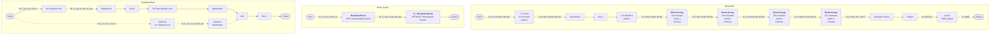

```mermaid
graph TD
    %% Main ResNet34 Architecture %%
    subgraph ResNet34 ["ResNet34"]
        Input(["Input"])
        -->|B, C=3, H=224, W=224| Conv["7×7 Conv<br>64 channels<br>stride 2"]
        -->|B, C=64, H=112, W=112| BatchNorm["BatchNorm"]
        --> ReLU["ReLU"]
        --> MaxPool["3×3 MaxPool<br>stride 2"]
        -->|B, C=64, H=56, W=56| BlockGroup1["<b>Block Group</b><br>64 channels<br>stride 1<br>3 blocks"]
        -->|B, C=64, H=56, W=56| BlockGroup2["<b>Block Group</b><br>128 channels<br>stride 2<br>4 blocks"]
        -->|B, C=128, H=28, W=28| BlockGroup3["<b>Block Group</b><br>256 channels<br>stride 2<br>6 blocks"]
        -->|B, C=256, H=14, W=14| BlockGroup4["<b>Block Group</b><br>512 channels<br>stride 2<br>3 blocks"]
        -->|B, C=512, H=7, W=7| AvgPool["Average Pooling"]
        --> Flatten["Flatten"]
        -->|B, 512x7x7| Linear["Linear<br>1000 outputs"]
        -->|B, 1000| Output(["Output"])
    end

    %% Block Group Structure %%
    subgraph BlockGroup ["Block Group"]
        BGInput(["Input"])
        -->|B, C_in, H_in, W_in| ResidualBlock1["<b>Residual Block</b><br>WITH downsample branch"]
        -->|B, C_out, H_out, W_out| ResidualBlock2["N-1 <b>Residual Blocks</b><br>WITHOUT downsample branch"]
        --> BGOutput(["Output"])
    end

    %% Residual Block with Downsample Structure %%
    subgraph ResidualBlock ["Residual Block"]
        RBInput(["Input"])
        -->|B, C_in, H_in, W_in| RBConv1["3x3 Strided Conv"]
        -->|B, C_out, H_out, W_out| RBBatchNorm1["BatchNorm"]
        --> RBReLU1["ReLU"]
        --> RBConv2["3x3 Non-Strided Conv"]
        --> RBBatchNorm2["BatchNorm"]
        --> RBAdd["Add"]
        --> RBReLU2["ReLU"] --> RBOutput(["Output"])

        %% Optional downsample branch %%
        RBInput
        -.->|B, C_in, H_in, W_in| DSConv["<i>Optional:</i><br>1×1 Strided Conv"]
        -.->|B, C_out, H_out, W_out| DSBatchNorm["<i>Optional:</i><br>BatchNorm"]
        -.-> RBAdd
    end
```
