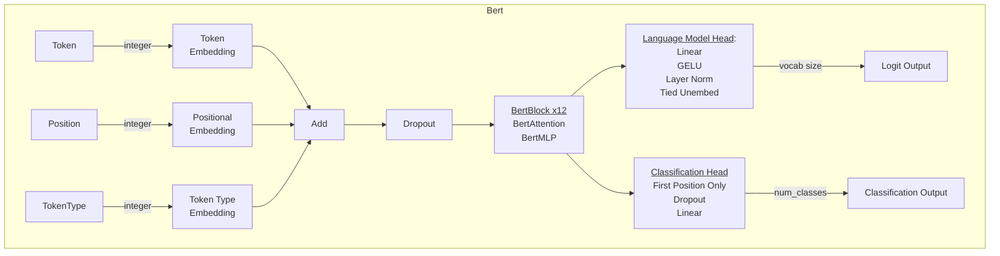
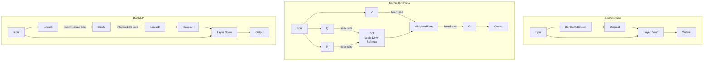

```mermaid
graph TD
    subgraph Bert
        Token --> |integer|TokenEmbed[Token<br>Embedding] --> AddEmbed[Add] --> Dropout --> BertBlocks[<u>BertBlock x12</u><br>BertAttention<br>BertMLP] --> Final[<u>Language Model Head</u>:<br>Linear<br>GELU<br>Layer Norm<br>Tied Unembed]--> |vocab size|Output[Logit Output]
        Position --> |integer|PosEmbed[Positional<br>Embedding] --> AddEmbed
        TokenType --> |integer|TokenTypeEmb[Token Type<br>Embedding] --> AddEmbed
        BertBlocks --> ClsHead[<u>Classification Head</u><br>First Position Only<br>Dropout<br>Linear] --> |num_classes|ClsOutput[Classification Output]
    end
```

```mermaid
graph TD
    subgraph BertAttention
        Input --> BertSelfInner[BertSelfAttention] --> AtnDropout[Dropout] --> AtnLayerNorm[Layer Norm] --> AtnOutput[Output]
        Input --> AtnLayerNorm
    end

    subgraph BertSelfAttention
        SA[Input] --> Q & K & V
        V -->|head size| WeightedSum
        Q & K --> |head size|Dot[Dot<br>Scale Down<br>Softmax] -->WeightedSum -->|head size| O --> SAOutput[Output]
    end

    subgraph BertMLP
        MLPInput[Input] --> Linear1 -->|intermediate size|GELU --> |intermediate size|Linear2 --> MLPDropout[Dropout] --> MLPLayerNorm --> MLPOutput[Output]
        MLPInput --> MLPLayerNorm[Layer Norm]
    end
```
