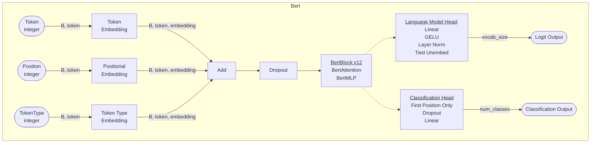

```mermaid
graph TD
    subgraph Bert
        Token([Token<br>integer])
        -->|B, token| TokenEmbed[Token<br>Embedding]
        -->|B, token, embedding| AddEmbed
        Position([Position<br>integer])
        -->|B, token| PosEmbed[Positional<br>Embedding]
        -->|B, token, embedding| AddEmbed
        TokenType([TokenType<br>integer])
        -->|B, token| TokenTypeEmb[Token Type<br>Embedding]
        -->|B, token, embedding| AddEmbed
        AddEmbed[Add]
        --> Dropout
        --> BertBlocks[<u>BertBlock x12</u><br>BertAttention<br>BertMLP]
        BertBlocks
        -.-> Final[<u>Language Model Head</u>:<br>Linear<br>GELU<br>Layer Norm<br>Tied Unembed]
        -->|vocab_size| Output([Logit Output])
        BertBlocks
        -.-> ClsHead[<u>Classification Head</u><br>First Position Only<br>Dropout<br>Linear]
        -->|num_classes| ClsOutput([Classification Output])
    end
```

```mermaid
graph TD
    subgraph BertAttention
        Input([Input])
        --> BertSelfInner[BertSelfAttention]
        --> AtnDropout[Dropout]
        --> AtnLayerNorm
        Input
        --> AtnLayerNorm
        AtnLayerNorm[Layer Norm]
        -->|B, token, embedding| AtnOutput([Output])
    end

    subgraph BertSelfAttention
        SA([Input])
        -->|B, token, embedding| Q & K & V
        V
        -->|B, head, token_k, v| WeightedSum
        Q
        -->|B, head, token, qk| Dot
        K
        -->|B, head, token, qk| Dot
        -->|B, head, token_q, token_k| ScaleDown
        --> Softmax
        --> WeightedSum
        -->|B, head, token_q, v| O
        -->|B, token_q, embedding| SAOutput([Output])
    end

    subgraph BertMLP
        MLPInput([Input])
        -->|..., embedding| Linear1
        -->|..., intermediate_size| GELU
        --> Linear2
        -->|..., embedding| MLPDropout[Dropout]
        --> MLPLayerNorm
        MLPInput
        --> MLPLayerNorm
        MLPLayerNorm[Layer Norm]
        --> MLPOutput([Output])
    end
```
