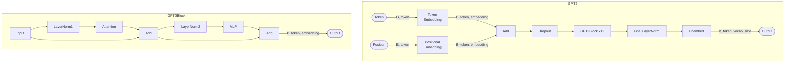
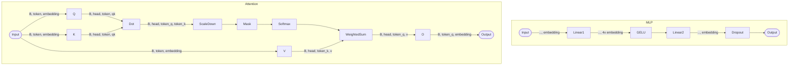

```mermaid
graph TD
    subgraph GPT2
        Token([Token])
        -->|B, token| TokenEmbed[Token<br>Embedding]
        -->|B, token, embedding| AddEmbed
        Position([Position])
        -->|B, token| PosEmbed[Positional<br>Embedding]
        -->|B, token, embedding| AddEmbed
        AddEmbed[Add]
        --> Dropout
        --> Blocks[GPT2Block x12]
        --> FinalLayerNorm[Final LayerNorm]
        -->Unembed
        -->|B, token, vocab_size| Output([Output])
    end

    subgraph GPT2Block
    Input
    --> LayerNorm1
    --> Attention
    --> Residual1[Add]
    --> LayerNorm2
    --> MLP
    --> Residual2
    -->|B, token, embedding| BlOutput([Output])
    Input
    --> Residual1
    Residual1
    --> Residual2[Add]
    end
```

```mermaid
graph TD
    subgraph SubMLP[MLP]
        MLPInput([Input])
        -->|..., embedding| Linear1
        -->|..., 4x embedding| GELU
        -->Linear2
        -->|..., embedding| MLPDropout[Dropout]
        --> MLPOutput([Output])
    end

    subgraph SubAttention[Attention]
        AtnInput([Input])
        -->|B, token, embedding| Q & K & V
        Q & K
        -->|B, head, token, qk| Dot
        -->|B, head, token_q, token_k| ScaleDown-->Mask-->Softmax
        --> WeightedSum
        -->|B, head, token_q, v| O
        -->|B, token_q, embedding| AtnOutput([Output])
        V
        -->|B, head, token_k, v| WeightedSum
    end
```
